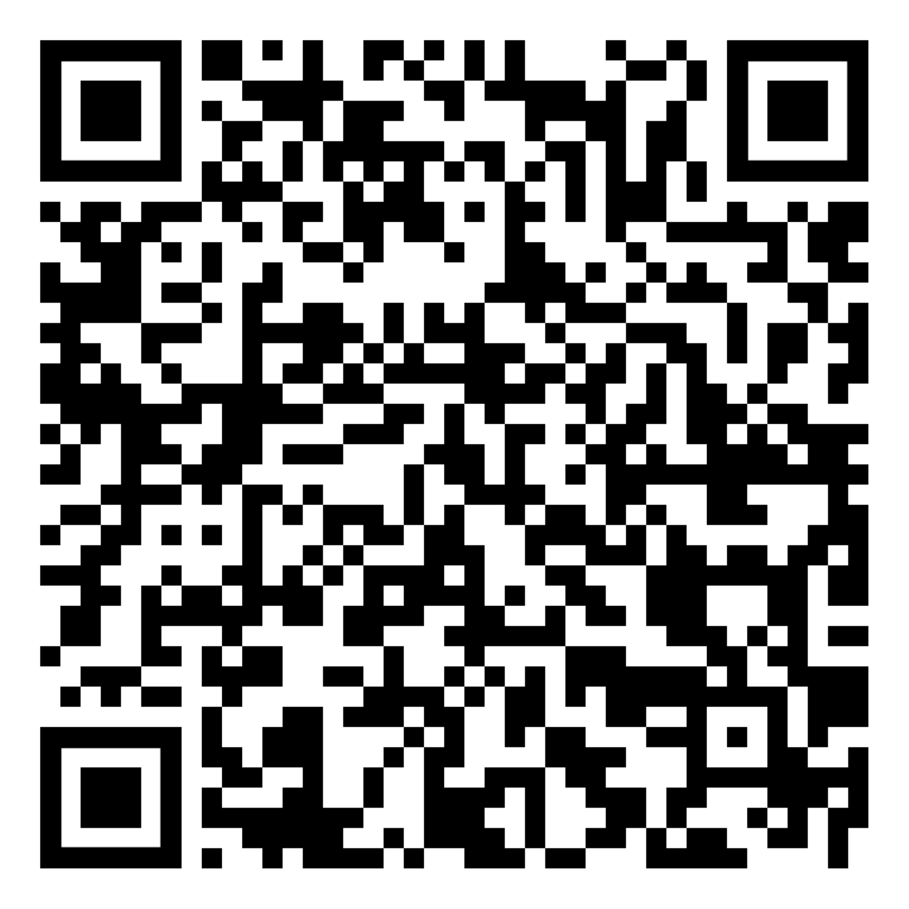

Repository for Exercise 1.3 of Embedded Cryptography Book Section 9

In this exercise, you can play with a MO-TRNG.
By scanning or clicking on the QR-code you can launch the application and observe how the number of oscillators,the jitter variance and the accumulation time affect Shannon entropy and min entropy rate.

Your goal is to find the the smallest D, for which the generator will produce random bits with a Shannon entropy rate higher than 0.997.

You should repeat the procedure for all possible &#x3C3tot &#8260 T1 and 	N values.

